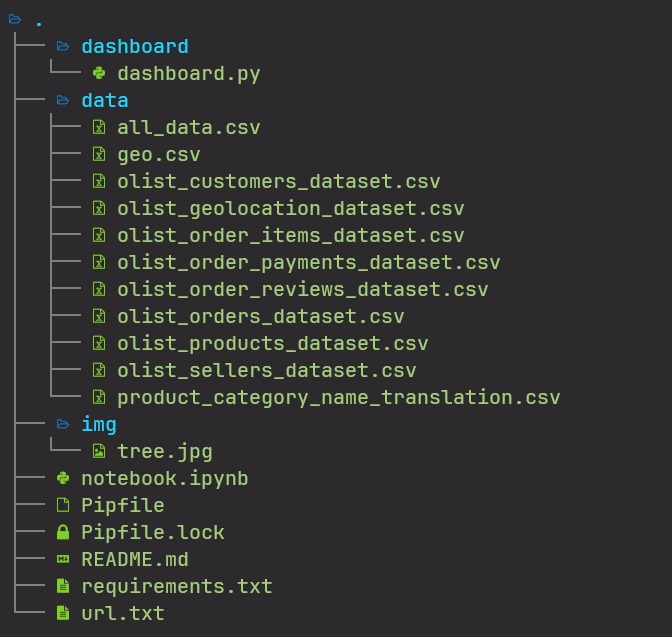

<h2 align='center'>Submission Dicoding "Belajar Data Analytics dengan Python"</h2>

**URL: [E-Commerce Olist Dashboard Streamlit App](google.com)**

### Table Of Content

- [Project Structure](#project-structure)
- [Installation](#installation)
- [Usage](#usage)
- [Data Source](#data-source)

### Project Structure

- `dashboard/`: This directory contains dashboard.py which is used to create dashboards of data analysis results.
- `data/`: Directory containing the raw CSV data files.
- `notebook.ipynb`: This file is used to perform data analysis.
- `README.md`: This documentation file.



### Installation

1. Clone this repository to your local machine:

```bash
git clone https://github.com/SaifulI57/analytics_dicoding.git
```

2. Go to the project directory

```bash
cd analytics_dicoding

```

3. Install the required Python package by running:

```bash
pip install -r requirement.txt
```

### Usage

```bash
cd analytics_dicoding/dashboard
streamlit run dashboard.py
```

Access the dashboard in your web browser at `http://localhost:8501`

### Data Source

The Project uses E-Commerce Public Dataset from [kaggle](https://www.kaggle.com/datasets/olistbr/brazilian-ecommerce?resource=download) offered by [Dicoding](https://dicoding.com)
